# Frontend Web Development Bootcamp Course by [Zack](https://www.youtube.com/watch?v=zJSY8tbf_ys)

#### <u> Relationship between HTML, CSS and JavaScript.</u>

> HTML, CSS and JavaScript are not born in isolation, they all work together to build a webpage.
>
- The 3 main tenants of Frontend Development i.e. <b>HTML</b>, <b>CSS</b> and <b>JavaScript</b>.

- Think of these 3 as a house:-
There's the <b>Structure</b>, <b>Styling</b> and <b>Functionality</b>
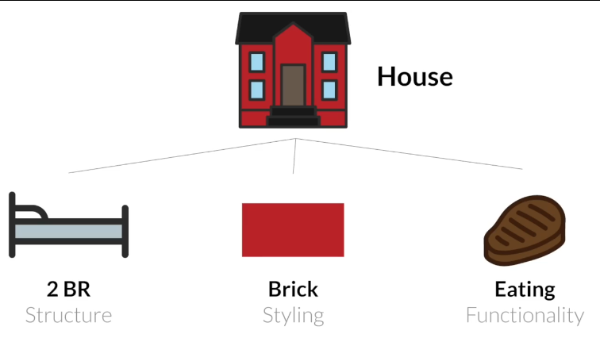

- The <b>Structure </b>would be the <b>HTML</b>, the <b>Functionality</b> would be the <b>JavaScript</b> and the <b>Styling</b> would be the <b>CSS</b>.

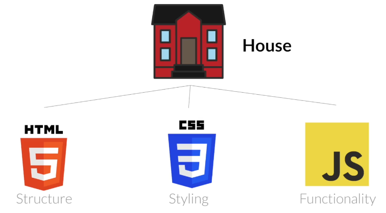

<u>Requirements</u>.
- Browser - Firefox [It has advanced Developer Tools]

1. ### JavaScript
- ####  JavaScript Basics
- <b>Developer Tools</b> : where you can Inspect Element(s) where there's the <b>Inspector</b>, <b>Console</b>, <b>Debugger</b>, etc

> ##### a) Console
> - Console is called the <b>REPL</b> which stands for <b>R</b>ead <b>E</b>valuate <b>P</b>rint and <b>L</b>oop.
> - It allows us to write JavaScript.
> - It allows us to modify the <b>D</b>ocument <b>O</b>bject <b>M</b>odel (DOM) 
> 
> <u>For Example</u>
> i) Use the console to change a background image as it could be done in the inspector
>
> 
> 
> 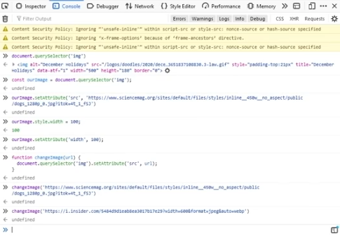

##### b) Network
For backend development :-
- API request
- HTTP requests

##### c) Storage
- Tracking user behavior on a site.
- Store cookies.
- For authentication.

> 
> <u>For Example</u>
> ii) Use the console to change a background color of the webpage by targeting the <body></body>
>
>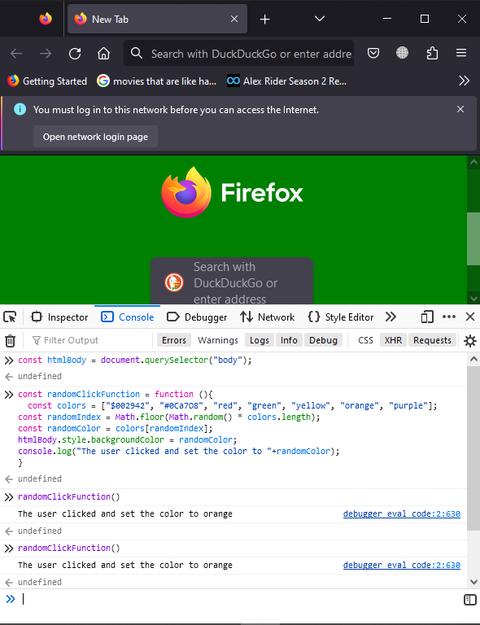

> ii) a) Change the background color of a webpage when you click on the webpage
> 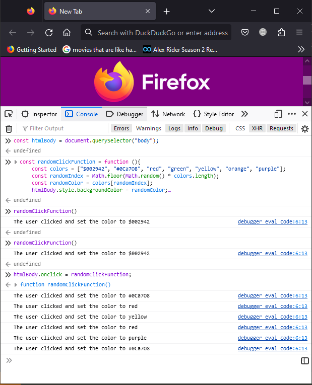

## What is JavaScript?
- JavaScript is a programming language for the web.

### What can you do with JS?
- Develop web applications using Angular, Reactjs, Vuejs, Nestjs(backend)
- Develop desktop applications using Electron
- Develop mobile applications using React Native, Native Script
- Develop AI and Machine learning projects using TensorFlow.

### What is a JavaScript Framework?  
- A framework is something built on top of a programming language.
- It is an abstraction on top of js that enables a developer to do something more efficiently in less time.
e.g. Facebook's frontend is built on Reactjs Library for efficiency and time saving.

### Is JavaScript the best language?
- It depends on the <u>Use case</u>
- For example, if you need a a web application, <i>JavaScript or a js framework</i> will be the best option
- If you need an AI for a Tesla car, <i>Python</i> would be the best option.
- If you need a banking application, <i>C or C++</i>, would be the best option.

### Do you need HTML and CSS to do JavaSCript?
- Yes and No.
- Yes, because HTML and CSS is used on the <b>Frontend</b>.
- No, JavaScript is used on both <b>Frontend</b> and <b>Backend</b>.

### What is the difference between ECMAScript and JavaScript?
> ES6 is the latest specification of ECMAScript.
- ECMA is an International organization in charge of Language Specification (Standards) - just like ISO
- JavaScript is an implementation of this Specification.
- And this is important for Browser compatability and other reasons.

## What is a Programming Language?
- This is a group of <b>tokens</b> or <b>symbols</b> when combined together in a very specific way can be translated by a compiler into machine code or (ones and zeros).
- To understand compilers, Runtime, Operating system theories etc, read the following book :- <b>The Elements of Computing Systems</b> [If you have time].
-    
> - If you're in a hurry to code, Read :- <b>The Hidden Language of Computer Hardware and Software</b> by <i>Charles Petzoi</i>

### Where does JavaScript run?
- Run time - is basically where an environment where code is run.
- JavaScript has 2 <i>Run times</i> which are <b>Nodejs Run time</b> and the <b>Browser Run time</b>.
- The browser Run time in Chrome uses [V8 engine](https://v8.dev) and this does all  the compilation, optimization etc.
- Nodejs which is the backend version of js or the run-time, also uses V8 engine.
- Mozilla uses <b>Spider Monkey</b> which was the original run time engine. 
- Listen to the <b>Browser Wars</b> podcasts.

## JavaScript Variables

### var, let and const keywords
> a) <b>var</b> allows re-declaring.
> e.g 
> <pre>
>    var myVar = 10;
>    var myVar = 20;
>    console.log(myVar); //it will give 20, it updates the value
> </pre>
>
>

>
> <b>const</b> -  it's used when you expect a value not to change. e.g. const taxRate = 0.9;
> It doesn't allow re-declaration and re-assigning.
> e.g 
> <pre>
>   const anotherVariable = 10;
>   const anotherVariable = 20; // SyntaxError : redeclaration of const anotherVariable
> </pre>
> 

> 
> <b>Let</b> - it's used every time you think you'll need to <b>re-assign</b> a variable.
> e.g.
> let 
> <pre>
>   let counter = 0;
>   counter = counter + 1;
>   counter++;
>   console.log(counter); //no errors
> </pre>
> 

### Style guides.
> Conventions used by different companies for different programming languages.
> i) Google JavaScript Style Guide
> [Google JavaScript Style Guide](https://google.github.io/styleguide/jsguide.html)
> ii) Airbnb JavaScript Style Guide
> [Airbnb JavaScript Style Guide](https://github.com/airbnb/javascript)
> iii) W3schools
> [JavaScript Style Guide](https://www.w3schools.com/js/js_conventions.asp)

### JavaScript Data types
> JavaScript is a Dynamically typed language.
- There are 5 main data types in JS i.e. Numbers, Strings, Booleans, Arrays and Objects.

- Numbers
> e.g. const num = 10;

- Booleans
> true or false;

- Strings
> const myString = "Lailah Grant";

- Arrays
> list of items of any data types.
> Arrays are indexed from 0.
> e.g. 
> <pre>
>   const firstArray = [10, 20, 30, 40];
> const secondArray = [10, 'a string', {prop : 'hullahop'}, [1,2]];
>
> console.log(firstArray[0]);
> console.log(secondArray[3]);
> console.log(secondArray[3][1]); //2
> </pre>

- Objects
> - Complex container.
> - key-value pair.
> - Everything is an object in JavaScript.
> - To access the values in an object, we use <b>dot(.) notation</b>.
> - You can also use the <b>[ "propertyName" ]</b>
> <pre>
> const objVar = {prop1: 20, prop2: 20,};
> console.log(objVar["prop1"]);
> 
> </pre>
> To access the values in an object, we use <b>dot(.) notation</b>.
> <pre>
> const nestedObj = {
>   layer1: {
>       layer2: {
>           layer3: {
>              targetValue:20
> } 
> }
> }
> }
>
> //to get the value, use the . notation
> console.log(nestedObj.layer1.layer2.layer3.targetValue);
> </pre>

- Functions
> can store functions in a variable
> <pre>
>   const functionVar = function(){
>   return 20;
> }
> //call fn 
> functionVar();
> </pre>

### Day 01 Challenges

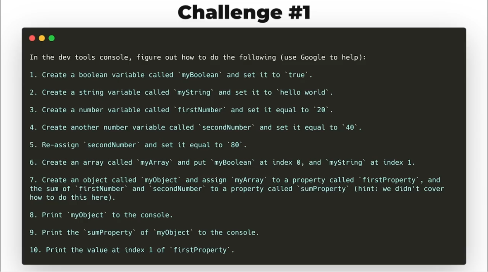

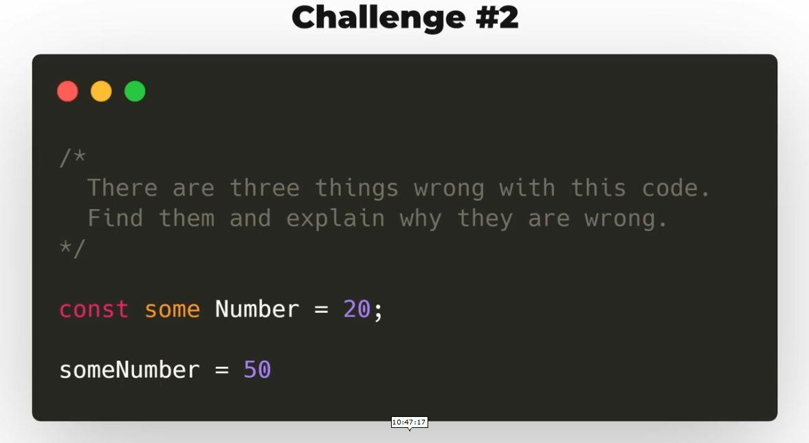

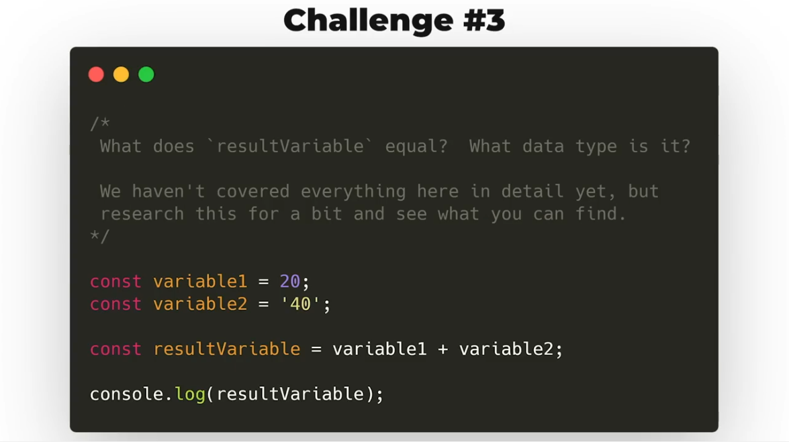

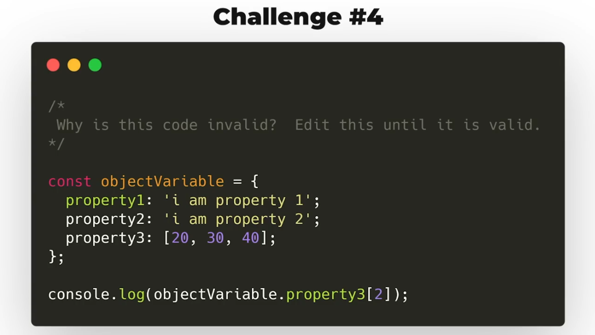

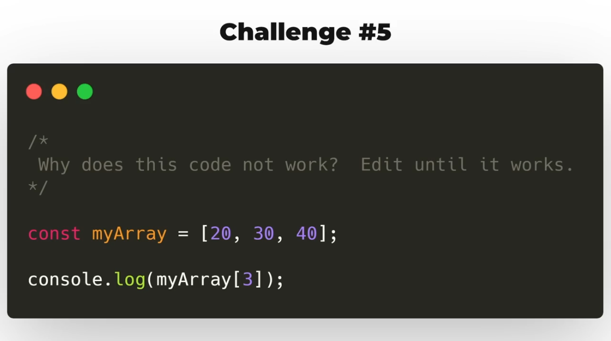

### JavaScript Operators

- An operator is something that allows you to either compare two values, modify values, combine values.
- There a 4 main types of operators: 
  - Arithmetic Operators like + , -, *, /, %, **, ++, --
  - Assignment Operators like =, +=, -=, *=, /=
  - Logical Operators like &&, || and !
  - Comparison Operators like ==, ===, !=, !==, >, <, <=, >=, ternary operator(... ? ' ' : ' ')

- <b>typeof</b> - 

> Arithmetic Operators
> 
> Assignment operators
> 
> Comparison Operators
> They return true or false.
> e.g 
> <pre>
> const result = 20 > 18;
> console.log(result);
> </pre>
> 

> === is the LS and RS equal in both value and datatype?
> <pre>
> const result1= 20 === 20;
> console.log(result1);
> </pre>
> 

>
> ternary operator
> condition ? 'one result or value' : 'other result or value';
> e.g. 
> <pre>
> const result = 20 === 20 ? 'values match' : 'values do not match';
> </pre>
> the above us the same as - the equation below
> <pre>
>  if(20 === 20){
> resultVar = 'Values match';
> } else{
> resultVar = 'Values do not match';
> }
> </pre> 
> 
> 

>
> Logical Operators like &&, || and !
> - && (and) - both sides should return true
> - || (or) - one side  is true, it's false
> - ! (not) - reverse an expression e.g. !(20 === 20); //return false
>
> <pre>
> const isUserLoggedIn = true;
> const doesUserHavePermission = false;
> const canUserPerformAction = isUserLoggedIn && doesUserHavePermission;
> </pre>
>
> clear();
>
> <pre>
> const result = () => {
>   return 20;
> };  //this fn has no way of being called, so we do the following:-
> 
> const result = ( () => {
>   return 20;
> })(); //an immediately invoked function
> </pre>

#### Refer to CodeWars during Challenges.

### Day 02 Challenges

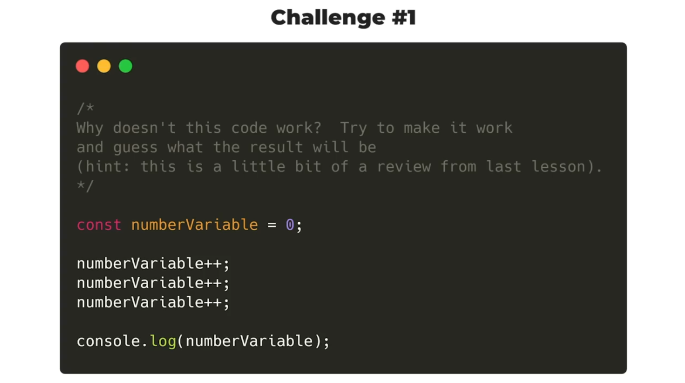

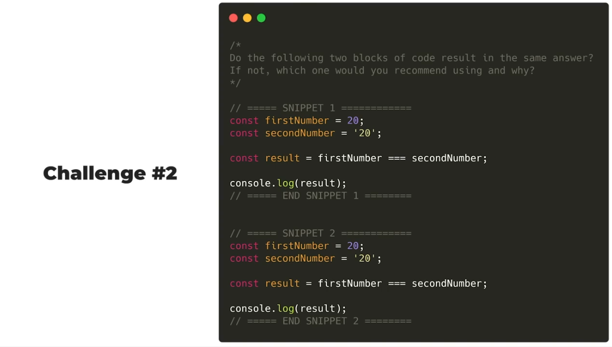

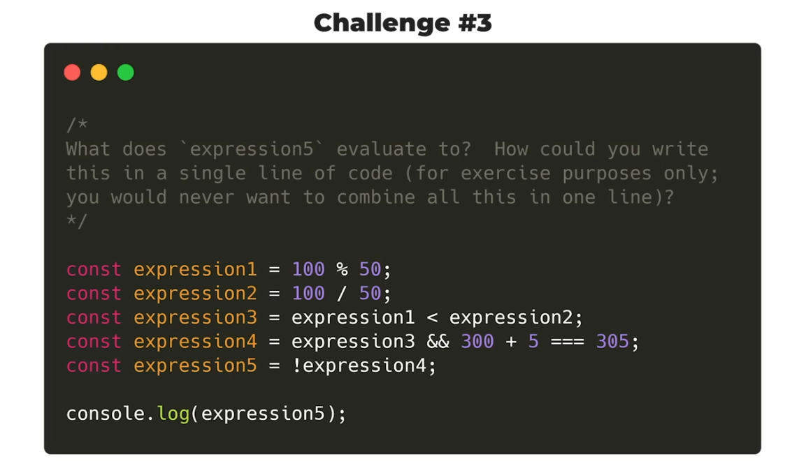

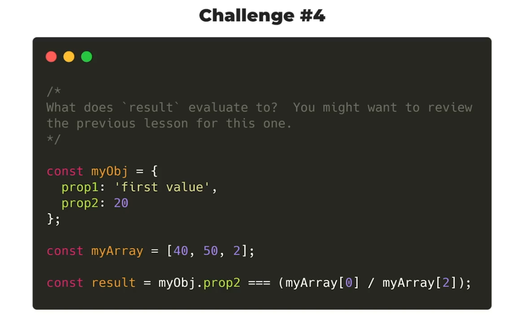

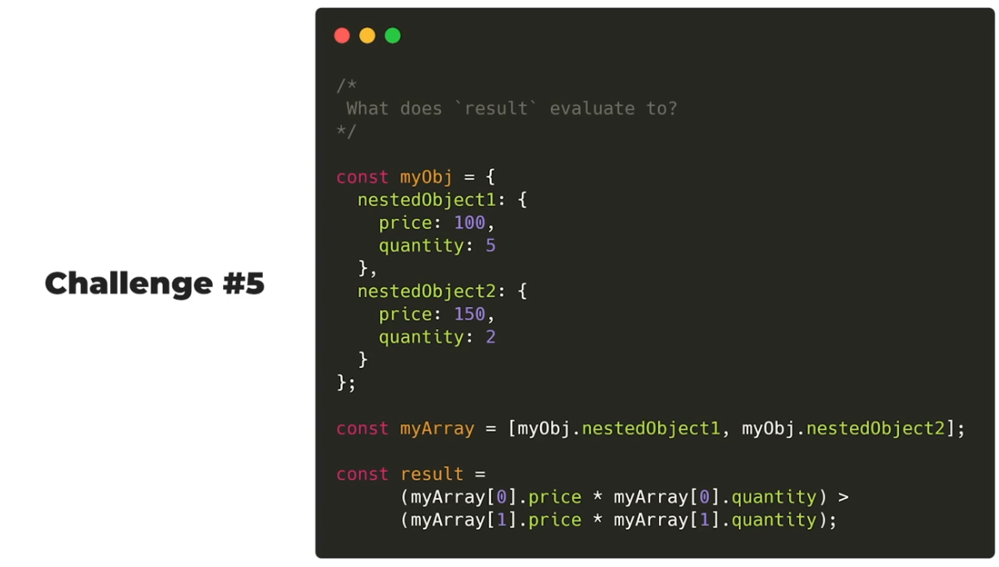

