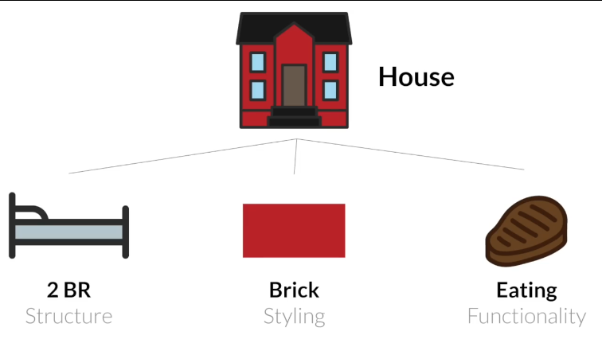
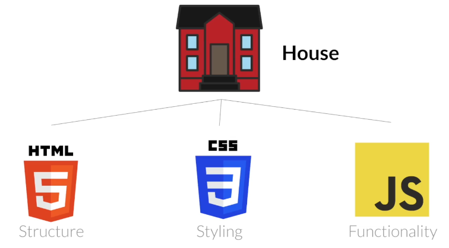
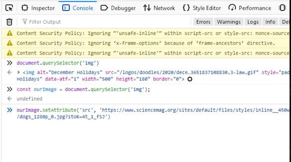
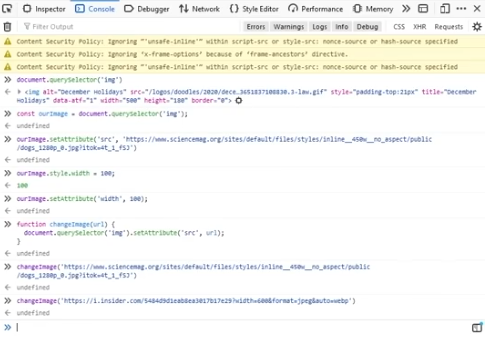
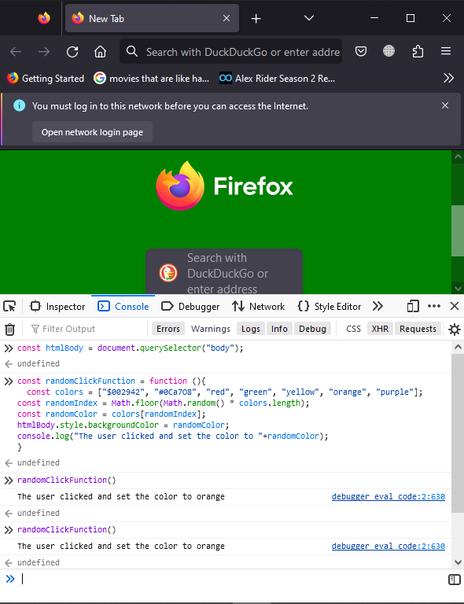
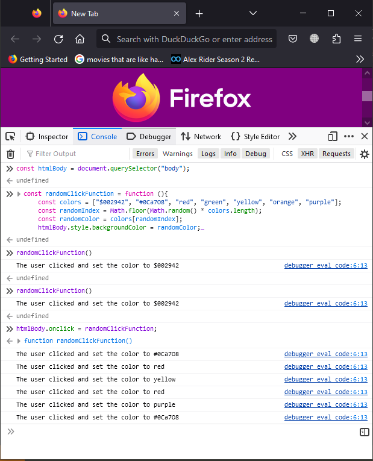

# Frontend Web Development Bootcamp Course by [Zack](https://www.youtube.com/watch?v=zJSY8tbf_ys)

#### <u> Relationship between HTML, CSS and JavaScript.</u>

> HTML, CSS and JavaScript are not born in isolation, they all work together to build a webpage.
>
- The 3 main tenants of Frontend Development i.e. <b>HTML</b>, <b>CSS</b> and <b>JavaScript</b>.

- Think of these 3 as a house:-
There's the <b>Structure</b>, <b>Styling</b> and <b>Functionality</b>

- The <b>Structure </b>would be the <b>HTML</b>, the <b>Functionality</b> would be the <b>JavaScript</b> and the <b>Styling</b> would be the <b>CSS</b>.

<u>Requirements</u>.
- Browser - Firefox [It has advanced Developer Tools]

1. ### JavaScript
- ####  JavaScript Basics
- <b>Developer Tools</b> : where you can Inspect Element(s) where there's the <b>Inspector</b>, <b>Console</b>, <b>Debugger</b>, etc

> ##### a) Console
> - Console is called the <b>REPL</b> which stands for <b>R</b>ead <b>E</b>valuate <b>P</b>rint and <b>L</b>oop.
> - It allows us to write JavaScript.
> - It allows us to modify the <b>D</b>ocument <b>O</b>bject <b>M</b>odel (DOM) 
> 
> <u>For Example</u>
> i) Use the console to change a background image as it could be done in the inspector
>
> 
> 
> 

##### b) Network
For backend development :-
- API request
- HTTP requests

##### c) Storage
- Tracking user behavior on a site.
- Store cookies.
- For authentication.

> 
> <u>For Example</u>
> ii) Use the console to change a background color of the webpage by targeting the <body></body>
>
>

> ii) a) Change the background color of a webpage when you click on the webpage
> 

## What is JavaScript?
- JavaScript is a programming language for the web.

### What can you do with JS?
- Develop web applications using Angular, Reactjs, Vuejs, Nestjs(backend)
- Develop desktop applications using Electron
- Develop mobile applications using React Native, Native Script
- Develop AI and Machine learning projects using TensorFlow.

### What is a JavaScript Framework?  
- A framework is something built on top of a programming language.
- It is an abstraction on top of js that enables a developer to do something more efficiently in less time.
e.g. Facebook's frontend is built on Reactjs Library for efficiency and time saving.

### Is JavaScript the best language?
- It depends on the <u>Use case</u>
- For example, if you need a a web application, <i>JavaScript or a js framework</i> will be the best option
- If you need an AI for a Tesla car, <i>Python</i> would be the best option.
- If you need a banking application, <i>C or C++</i>, would be the best option.

